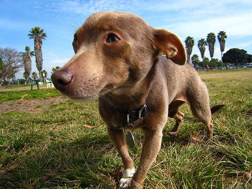
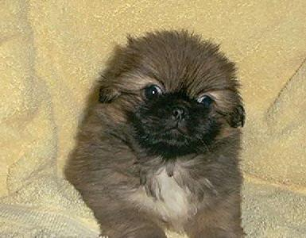
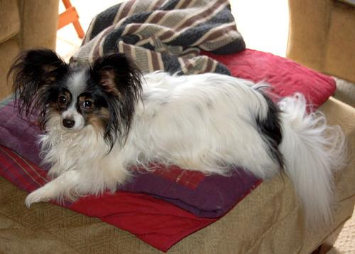
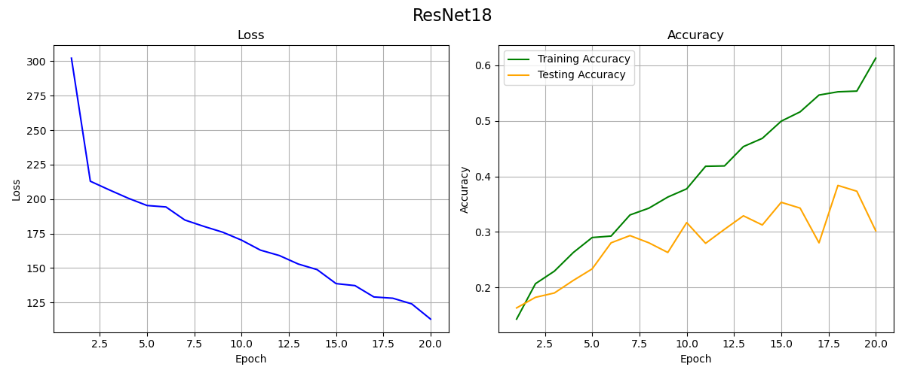
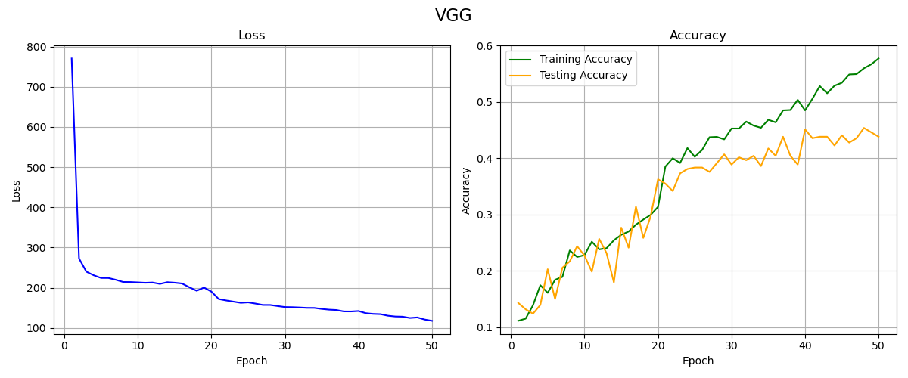

# StanfordDogs
### **"It's just a simple practice."**   
After several months, I have forget something about deep learning and cant even write code.  

I will finish and polish it slowly.    
**(Now this project ends wonderfully in Nov.17th 2024, final core code is: [main.py](main.py) )**   
## Dataset    
The Stanford Dogs dataset contains images of 120 breeds of dogs from around the world. This dataset has been built using images and annotation from ImageNet for the task of fine-grained image categorization.  
(before：**I choose 10 categories to reduce train difficulty.**）       
after: **contains all 120 categories**   
Download dataset at: http://vision.stanford.edu/aditya86/ImageNetDogs/     
Here are some pictures of cute dogs to be category:   
<table>
  <tr>
    <td align="center">
       
      
<b>Chihuahua</b>

    </td>
    <td align="center">
       
      
<b>Pekinese</b>

    </td>    
    <td align="center">
       
      
<b>Papillon</b>

    </td>
  </tr>
</table>    

### Exploration and Results   
## Overfitting   
I tried some simple model at first. See them at: [models](models)     
Including CNN: [CNN](models/CNN.py), VGG11: [VGG](models/VGG.py). However they don't performance well.      
Accuracy in train can achieve 100% but low in test. It's **overfitting**. Because images in dataset are not enough.
## Data Enhancement  
I do some work to enhance the data for example:     
rotation,nomalization and so on. See them in `main.py`, transform module.      
I'm happy to see the difference between test and train becomes small but both of them can only reach 60% percent           
## Complex Network   
Maybe my model is too simple?        
I tried resnet18: [resnet18](models/ResNet.py).       
**No contribution!**    
## Transfer Learning and results   
Transfer learning may be more effective for small sample scenarios.    
I used the trained resnet18 model for fine-tuning, and the results were obvious: [results](results)       
Accuracy on test and train set both reach 93% !     

Finally I visualized loss and accuracy in training process of different method (10 categories):    
<table>
  <tr>
    <td align="center">
       
      
<b>Pretrained resnet18</b>

    </td>
  </tr>
</table>
<table>
  <tr>   
    <td align="center">
       
      
<b>ResNet18</b>

    </td>   
  </tr>
</table>
<table>
  <tr>   
    <td align="center">
       
      
<b>VGG</b>

    </td>
  </tr>
</table>      

120 categories of pretrained resnet:   

### Inspirations   
After the practice, something useful I have learnt will be shared here   
## Transfer Learning   
Transfer learning is effective for training small samples and is also less difficult, we just need to fine-tune the trained model to produce good results.     
**It's especially useful for Stanford Dogs dataset.**    
## Data Preprocessing
Easier to obtain health featrues. Reduce training difficulty.
